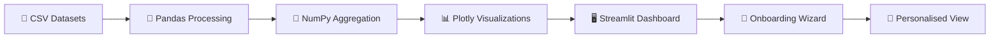

<div align="center">


<br/>

<a href="#-features">

</a>

<br/><br/>


<br/>


<br/><br/>


**A data analytics dashboard that turns raw job-market data into a story — built for freshers, by a fresher.**

</div>

---

## 📌 Table of Contents

<details open>
<summary>Click to expand</summary>

- [✨ Features](#-features)
- [🎥 Live Preview](#-live-preview)
- [🛠 Tech Stack](#-tech-stack)
- [📂 Project Structure](#-project-structure)
- [🚀 Getting Started](#-getting-started)
- [🧠 How It Works](#-how-it-works)
- [🗺 Roadmap](#-roadmap)
- [🤝 Contributing](#-contributing)
- [👨‍💻 Author](#-author)

</details>

---

## ✨ Features

<table>
<tr>
<td width="50%" valign="top">

### 🗺 Job Heatmap
Interactive density map of job openings across Indian cities — zoom, hover, and explore hiring hotspots in real time.

### 📊 Market Metrics
Total jobs, average, median & mode salary — the pulse of the market at a glance.

### 📈 Sector Demand
Bar chart of hiring activity by industry, ranked and colour-coded.

### 💰 Salary Distribution
Histogram of salary ranges across roles, so you know exactly where you stand.

### 🏙 Jobs by City
Cities ranked by hiring volume — find where the opportunities actually are.

### 🧠 Skill Analysis
Top 10 most in-demand skills, updated dynamically with your filters.

</td>
<td width="50%" valign="top">

### 🏆 City Leaderboard
Ranked table with market share % — a competitive view of India's job hubs.

### 🏢 Top Companies
Top 8 hiring companies with logos, pulled straight from the dataset.

### 🔍 Smart Search
Instantly filter listings by company or skill — no page reloads.

### 🌙 Dark / Light Mode
One-click theme toggle with smooth CSS transitions.

### 🧙 Onboarding Wizard
A 3-step profile setup that auto-personalises every filter on the dashboard.

### ⬇️ CSV Export
Download your filtered job listings for offline analysis.

</td>
</tr>
</table>

---

## 🎥 Live Preview

<div align="center">

```
┌─────────────────────────────────────────────┐
│   🔍  JobLens India  —  Dashboard Preview    │
├─────────────────────────────────────────────┤
│   [ Heatmap ]  [ Salary Chart ]  [ Sectors ] │
│                                               │
│   ▓▓▓▓▓▓▓▓░░░░  Bengaluru   ████████ 18.2%  │
│   ▓▓▓▓▓▓░░░░░░  Pune        ██████   12.4%  │
│   ▓▓▓▓▓░░░░░░░  Hyderabad   █████    10.1%  │
└─────────────────────────────────────────────┘
```

*Run the app locally to see the full interactive experience — heatmaps, live filters, and animated charts included.*


</div>

> 💡 **Tip:** Add real screenshots or a screen-recorded GIF here once deployed —
> drop them in a `/assets` folder and reference them like:
> ``

---

## 🛠 Tech Stack

<div align="center">

| Layer | Tools |
|---|---|
| **Language** |  |
| **Framework** |  |
| **Data Handling** |   |
| **Visualization** |  |

</div>

---

## 📂 Project Structure

```bash
JobLens-India/
│
├── joblens_app.py                 # Main Streamlit application
├── joblens_india_dataset.csv      # Core job listings dataset
├── joblens_company_logos_100.csv  # Company logo mappings
└── README.md                      # You are here 📍
```

---

## 🚀 Getting Started

### 1️⃣ Clone the repository
```bash
git clone https://github.com/TusharMagar/JobLens-India.git
cd JobLens-India
```

### 2️⃣ Install dependencies
```bash
pip install streamlit pandas numpy plotly
```

### 3️⃣ Run the app
```bash
streamlit run joblens_app.py
```

### 4️⃣ Open in browser
Streamlit will auto-launch at:
```
http://localhost:8501
```

<div align="center">

</div>

---

## 🧠 How It Works



1. **Load** — Job listings & company data are read from CSV.
2. **Wizard** — A 3-step onboarding captures the user's role, city, and skill focus.
3. **Filter** — Inputs personalise the heatmap, charts, and leaderboard live.
4. **Visualize** — Plotly renders interactive charts; Streamlit ties it all together.
5. **Export** — Users can download their filtered view as CSV.

---

## 🗺 Roadmap

- [x] Job heatmap & market metrics
- [x] Onboarding wizard
- [x] Dark/Light mode
- [ ] User accounts & saved searches
- [ ] Live job-board API integration
- [ ] Deploy to Streamlit Community Cloud

---

## 🤝 Contributing

Contributions, issues, and feature requests are welcome!

```bash
# Fork it, then:
git checkout -b feature/your-feature
git commit -m "Add your feature"
git push origin feature/your-feature
```
Open a Pull Request and let's make JobLens even better. ⭐

---

## 👨‍💻 Author

<div align="center">

**Tushar Magar**
Bachelor of Computer Science · Aspiring Data Analyst / Data Scientist


<br/><br/>

⭐ **If JobLens India helped you, consider giving it a star!** ⭐


</div>
